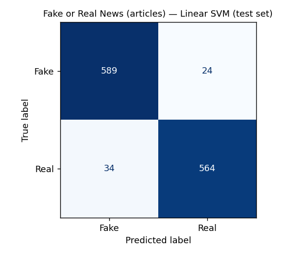
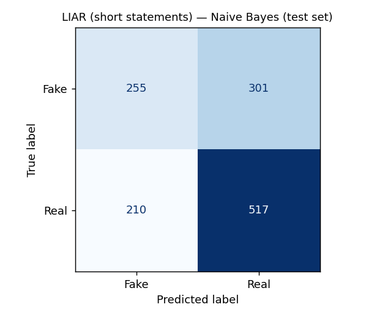
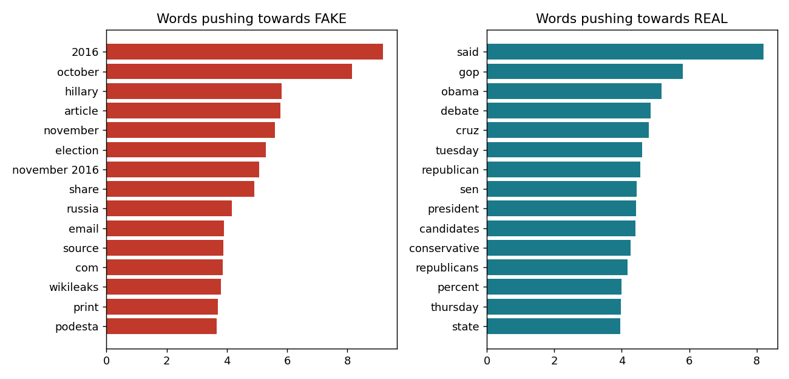

# Fake News Detector


Text classification of news as **fake** or **real** with interpretable NLP models (TF-IDF + Naive Bayes,
Logistic Regression, Linear SVM), benchmarked on **two public datasets** of very different difficulty:
full news articles and short political statements.

## Results

Models are compared with **stratified 5-fold cross-validation** on the training set; the best one is chosen
on cross-validation (not on the test set) and then evaluated once on a held-out test set.

### 1. Fake or Real News — full articles

6,053 articles after cleaning (balanced: 50% fake), 80/20 stratified split.

| Model | CV F1-macro (5-fold) | Test accuracy | Test F1 (fake) | Test F1-macro |
|---|---|---|---|---|
| Naive Bayes | 0.923 ± 0.007 | 0.927 | 0.925 | 0.926 |
| Logistic Regression | 0.936 ± 0.004 | 0.950 | 0.951 | 0.950 |
| **Linear SVM** | **0.939 ± 0.003** | **0.952** | **0.953** | **0.952** |



**95.2% accuracy, F1 = 0.95** on 1,211 unseen articles: 24 fake articles missed, 34 real articles wrongly flagged.

### 2. LIAR — short political statements

12,836 one-sentence statements fact-checked by PolitiFact (Wang, 2017), **official train/valid/test splits**,
6 truthfulness levels mapped to binary (`pants-fire`, `false`, `barely-true` → fake; `half-true`,
`mostly-true`, `true` → real).

| Model | CV F1-macro (5-fold) | Test accuracy | Test F1 (fake) | Test F1-macro |
|---|---|---|---|---|
| **Naive Bayes** | **0.591 ± 0.004** | 0.602 | 0.500 | 0.584 |
| Logistic Regression | 0.586 ± 0.009 | 0.610 | 0.525 | 0.597 |
| Linear SVM | 0.584 ± 0.010 | 0.612 | 0.533 | 0.600 |



About **60% accuracy** vs **56.7%** for a majority-class baseline. Deciding whether a single sentence is
true requires world knowledge the text alone does not contain, which is why LIAR is a hard benchmark and
text-only models stay close to this level.

## What the model actually learns



The logistic regression weights are a warning as much as a result. On the article dataset, the strongest
"fake" signals are **`2016`, `october`, `november`, `share`, `print`, `com`, `source`**: artefacts of how
the fake articles were collected (scraped from websites in October–November 2016, with sharing and print
buttons), not of the claims themselves. The "real" side is dominated by wire-style reporting (`said`,
`tuesday`, `sen`, `percent`). The 95% score therefore partly measures **source and style**, and would
likely drop on articles from other periods or outlets. LIAR, which contains only the statement, gives the
more realistic picture of what text-only fact-checking can do.

## Project structure

```
scripts/download_data.py   downloads both datasets and converts them to text,label CSV files
src/experiments.py         benchmark: 3 models x 2 datasets, CV + test, figures and reports/results.*
src/train.py               train one model (TF-IDF + logistic regression) and save it
src/predict.py             classify a text from the command line
reports/                   results.json, results.md and figures (generated)
tests/                     unit tests
data/sample_news.csv       tiny starter set used by the tests
```

## Reproduce

```bash
python -m venv .venv && source .venv/bin/activate   # Windows: .venv\Scripts\activate
pip install -r requirements.txt

python scripts/download_data.py    # ~40 MB, public GitHub mirrors
python src/experiments.py          # about 2 minutes on a laptop CPU, random_state=42
```

Train a model and classify your own text:

```bash
python src/train.py                # data/fake_or_real_news.csv -> model.joblib
python src/predict.py "The Senate voted 52-48 on Tuesday to confirm the nominee, Republican leaders said."
# REAL (73% confidence)
```

Run the tests with `pytest`.

## Data sources

- **Fake or Real News**: 6,335 articles from the 2016 US election period, collected by George McIntire
  ([mirror](https://github.com/lutzhamel/fake-news)). Cleaning removes 42 near-empty articles and 240
  duplicated article bodies so that no article appears in both train and test.
- **LIAR**: W. Y. Wang, *"Liar, Liar Pants on Fire": A New Benchmark Dataset for Fake News Detection*,
  ACL 2017 ([mirror](https://github.com/thiagorainmaker77/liar_dataset)).

## Next steps

- Fine-tune a transformer (DistilBERT / RoBERTa) and compare on both datasets
- Cross-dataset test: train on articles, evaluate on articles from another source, to measure the style bias
- Add LIAR metadata (speaker, party, context), known to help more than the text alone

## Author

**Assim Ayoub**, [@A2A-o4](https://github.com/A2A-o4)
